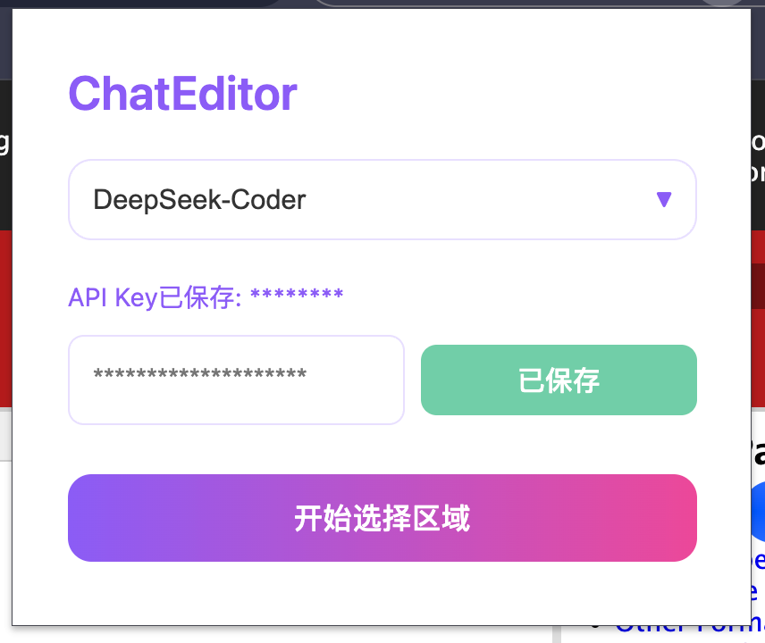
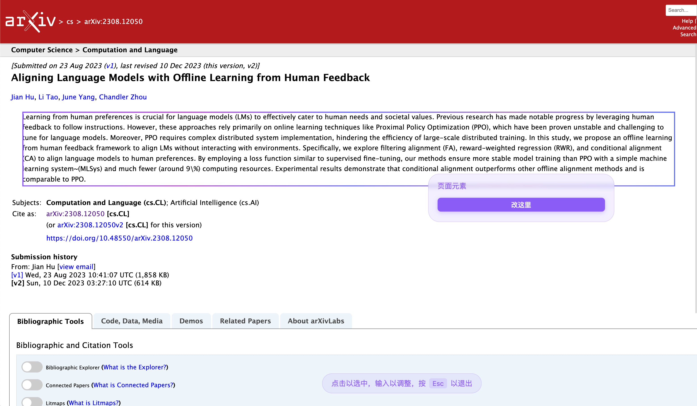
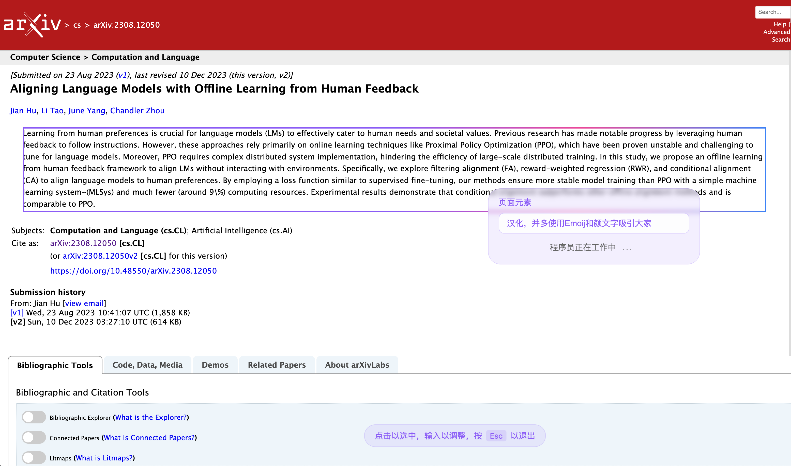
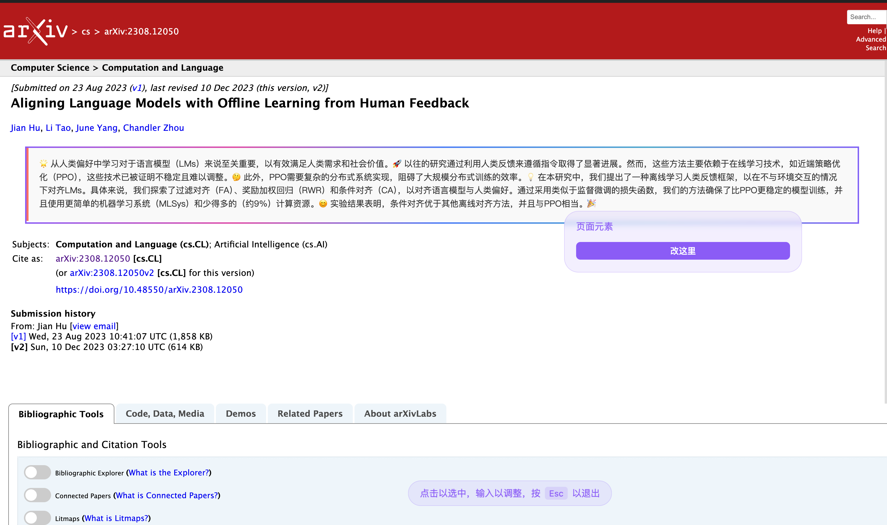

  
  
  # ChatEditor
  
  ### 指手画脚即可改这改那，享受产品经理的快乐吧！

## 简介

ChatEditor 是一个 Chrome 扩展，让你能像产品经理一样，通过简单的对话来修改网页内容。无需编写代码，只需用自然语言描述你想要的改动，AI 就能帮你实现。

## 功能特点

- 🖱️ 点击选择任意网页元素
- 💬 使用自然语言描述修改需求
- 🤖 AI 智能理解并生成代码
- ⚡ 实时预览修改效果
- 🔄 支持多种 AI 模型

## 使用截图

  
  
<em>选择模型并配置API Key</em>

  
  
<em>选择想要修改的元素</em>

  
  
  
<em>输入修改需求</em>

  
  
  
<em>查看修改效果</em>

## 安装使用

1. 下载本项目代码
2. 打开 Chrome 扩展管理页面 (`chrome://extensions/`)
3. 开启"开发者模式"
4. 点击"加载已解压的扩展程序"
5. 选择项目目录即可

## 配置说明

首次使用需要配置 AI 模型的 API Key：

- 支持 DeepSeek（默认）
- GPT-4
- Claude
- Yi

在扩展的弹出窗口中完成配置即可开始使用。